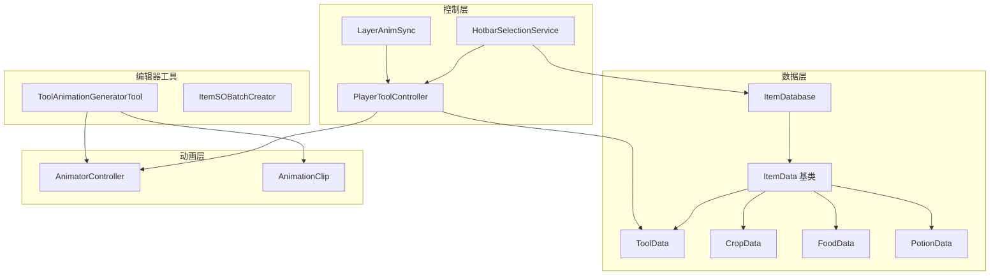

# 设计文档

## 概述

本设计文档描述了工具动画系统重构和精力系统实现的技术方案。主要目标是：
1. 简化工具动画配置，使用 itemID 作为动画匹配的唯一标识符
2. 修复空槽位报错问题
3. 统一品质属性的使用范围
4. 优化动画控制器结构
5. 实现精力系统，与 UI 联动
6. 工具增加"造成伤害"可选属性，武器不消耗精力

## 架构

### 系统架构图



### 动画状态名命名规范（简化版）

```
{ActionType}_{Direction}_Clip_{ItemID}
```

**重要设计决策**：每个品质的工具都是独立的 ItemID，不再使用 quality 后缀区分。

示例：
- `Slice_Down_Clip_0` - ItemID=0 的斧头（普通品质），向下方向
- `Slice_Down_Clip_1` - ItemID=1 的斧头（铜品质），向下方向
- `Crush_Side_Clip_10` - ItemID=10 的镐子，侧面方向

### 控制器命名规范

```
{ActionType}_Controller_{ItemID}_{ItemName}
```

示例：
- `Slice_Controller_0_Axe` - ItemID=0 的斧头控制器
- `Crush_Controller_10_Pickaxe` - ItemID=10 的镐子控制器

## 组件和接口

### 1. ItemDatabase

**职责**: 管理所有物品数据，提供查询接口

**关键修改**:
- `GetItemByID(int id)`: 当 id=-1 时静默返回 null，不输出警告

```csharp
public ItemData GetItemByID(int id)
{
    // -1 表示空槽位，静默返回 null
    if (id < 0)
        return null;
    // ... 正常查询逻辑
}
```

### 2. ToolData

**职责**: 存储工具的属性和动画配置

**关键字段**:
- `itemID`: 物品唯一 ID（继承自 ItemData）
- `animatorController`: 工具专用的 AnimatorController
- `animationFrameCount`: 动画帧数
- `animActionType`: 动画动作类型

**关键方法**:
```csharp
// 获取动画ID，直接返回 itemID
public int GetAnimationId()
{
    return itemID;
}
```

### 3. PlayerToolController

**职责**: 管理工具切换和动画参数设置

**关键修改**:
- 使用 `ToolData.GetAnimationId()` 获取动画 ID
- 预缓存状态哈希时使用 itemID

```csharp
public void EquipToolData(ToolData data, int toolQuality)
{
    int animId = data.GetAnimationId(); // 直接使用 itemID
    CacheStateHashes(data, animId);
}
```

### 4. LayerAnimSync

**职责**: 实现玩家与工具动画的帧同步

**关键逻辑**:
- 使用 `Animator.Play()` 直接切换状态
- 从 PlayerToolController 获取缓存的状态哈希

### 5. AnimatorExtensions

**职责**: 提供安全的 Animator 参数操作

**关键修改**:
- 空控制器时静默跳过，不输出警告

### 6. ToolAnimationGeneratorTool

**职责**: 生成动画剪辑和控制器

**关键修改**:
- 使用 itemID 命名动画状态
- 只创建 Any State → 状态的转换，不创建状态间转换

### 7. EnergySystem（新增）

**职责**: 管理玩家精力值

**关键字段**:
- `maxEnergy`: 最大精力值（默认 150）
- `currentEnergy`: 当前精力值
- `energySlider`: UI Slider 引用（UI/State/EP）

**关键方法**:
```csharp
// 消耗精力（成功操作时调用）
public bool TryConsumeEnergy(int amount)
{
    if (currentEnergy >= amount)
    {
        currentEnergy -= amount;
        UpdateUI();
        return true;
    }
    return false; // 精力不足
}

// 恢复精力
public void RestoreEnergy(int amount)
{
    currentEnergy = Mathf.Min(currentEnergy + amount, maxEnergy);
    UpdateUI();
}

// 完全恢复（睡觉时）
public void FullRestore()
{
    currentEnergy = maxEnergy;
    UpdateUI();
}
```

**事件**:
- `OnEnergyChanged(int current, int max)`: 精力变化时触发
- `OnEnergyDepleted`: 精力耗尽时触发

### 8. ToolData 扩展

**新增字段**:
```csharp
[Header("=== 伤害配置（可选）===")]
[Tooltip("是否可以造成伤害")]
public bool canDealDamage = false;

[Tooltip("伤害值（仅当 canDealDamage=true 时有效）")]
public int damageAmount = 5;
```

### 9. PlayerInteraction 修改

**职责**: 处理工具使用和精力消耗

**关键逻辑**:
```csharp
// 工具使用成功后消耗精力
public void OnToolActionSuccess(ToolData tool)
{
    if (tool != null && energySystem != null)
    {
        energySystem.TryConsumeEnergy(tool.energyCost);
    }
}
```

## 数据模型

### 品质属性分布

| 数据类型 | 是否有 baseQuality |
|---------|-------------------|
| ItemData (基类) | 否 |
| ToolData | 否 |
| WeaponData | 否 |
| SeedData | 否 |
| CropData | 是 |
| FoodData | 是 |
| PotionData | 是 |

### 工具与武器的区别

| 属性 | ToolData | WeaponData |
|-----|----------|------------|
| 消耗精力 | 是（成功操作时） | 否 |
| 造成伤害 | 可选（canDealDamage） | 是（默认） |
| 动画类型 | Slice/Crush/Pierce/Watering/Fish | Slice（攻击） |
| 使用场景 | 砍树、挖矿、浇水、耕种 | 战斗 |

### 精力系统配置

| 参数 | 默认值 | 说明 |
|-----|-------|------|
| 最大精力 | 150 | 玩家默认最大精力值 |
| UI 组件 | UI/State/EP | Slider 类型 |
| 恢复方式 | 睡觉/食物 | 每日睡觉恢复满，食物恢复部分 |

### 工具精力消耗

| 工具类型 | 默认消耗 | 触发条件 |
|---------|---------|---------|
| 斧头 (Axe) | 2 | 成功砍到树木 |
| 镐子 (Pickaxe) | 3 | 成功挖到矿石 |
| 锄头 (Hoe) | 2 | 成功耕地 |
| 水壶 (WateringCan) | 1 | 成功浇水 |
| 镰刀 (Sickle) | 1 | 成功收割 |
| 钓鱼竿 (FishingRod) | 0 | 钓鱼小游戏中消耗 |

### 动画控制器参数（简化版）

| 参数名 | 类型 | 说明 |
|-------|------|------|
| State | int | 动画状态（6=Slice, 7=Pierce, 8=Crush 等） |
| Direction | int | 方向（0=Down, 1=Up, 2=Side） |
| ToolItemId | int | 工具物品 ID |

**注意**：移除了 ToolQuality 参数，因为每个品质的工具都是独立 ItemID。

## 正确性属性

*属性是一种在系统所有有效执行中都应保持为真的特征或行为——本质上是关于系统应该做什么的形式化陈述。属性作为人类可读规范和机器可验证正确性保证之间的桥梁。*

### 属性 1: 动画 ID 一致性
*对于任意* ToolData 实例，`GetAnimationId()` 返回的值应等于该实例的 `itemID`
**验证: 需求 3.1**

### 属性 2: 动画状态名格式正确性
*对于任意* 动作类型、方向和 itemID 的组合，生成的状态名应符合格式 `{ActionType}_{Direction}_Clip_{ItemID}`
**验证: 需求 3.2, 5.2**

### 属性 3: 空槽位静默处理
*对于任意* itemId=-1 的查询，ItemDatabase 应返回 null 且不产生警告日志
**验证: 需求 1.1**

### 属性 4: 独立品质 ID
*对于任意* 同一工具的多个品质版本，它们应有独立的 itemID
**验证: 需求 3.6**

### 属性 5: 状态哈希缓存正确性
*对于任意* 装备的工具，缓存的状态哈希应基于该工具的 itemID 和所有可能的方向/品质组合生成
**验证: 需求 3.3**

### 属性 6: 精力消耗正确性
*对于任意* 工具使用操作，只有当操作成功时才消耗精力，操作失败时不消耗精力
**验证: 需求 - 精力系统**

### 属性 7: 精力值边界
*对于任意* 精力操作，当前精力值应始终在 [0, maxEnergy] 范围内
**验证: 需求 - 精力系统**

### 属性 8: 武器不消耗精力
*对于任意* WeaponData 的使用，不应消耗玩家精力
**验证: 需求 - 武器系统**

### 属性 9: UI 同步正确性
*对于任意* 精力值变化，UI Slider 的值应与当前精力值同步更新
**验证: 需求 - UI 联动**

### 属性 10: 工具图层顺序正确性
*对于任意* 工具动画显示状态，工具的 sortingOrder 应始终大于玩家的 sortingOrder
**验证: 需求 10.1, 10.2, 10.3**

## 错误处理

### 空槽位处理
- ItemDatabase: id < 0 时返回 null，不输出警告
- AnimatorExtensions: 无控制器时跳过操作，不输出警告
- HotbarSelectionService: 空槽位时跳过装备操作

### 动画状态不存在
- LayerAnimSync: 尝试回退到 quality=0 的状态
- 如果仍不存在，保持当前状态

## 测试策略

### 单元测试
- 测试 ItemDatabase.GetItemByID(-1) 返回 null
- 测试 ToolData.GetAnimationId() 返回 itemID
- 测试动画状态名生成格式

### 属性测试
使用 NUnit 的 TestCase 或 FsCheck 进行属性测试：
- 验证动画 ID 一致性
- 验证状态名格式正确性
- 验证品质版本 ID 一致性

### 集成测试
- 测试工具装备流程
- 测试动画同步流程
- 测试动画生成工具输出
