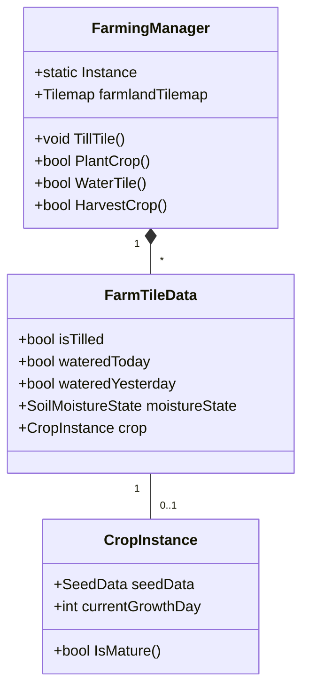

# 农田系统设计交接文档

**项目名称**：Sunset 农场模拟游戏  
**文档版本**：1.0.0  
**最后更新**：2025-12-09  
**作者**：AI助手  

## 目录
1. [系统概述](#1-系统概述)
2. [核心功能](#2-核心功能)
3. [技术实现](#3-技术实现)
4. [代码结构](#4-代码结构)
5. [资源需求](#5-资源需求)
6. [使用说明](#6-使用说明)
7. [问题与解决方案](#7-问题与解决方案)
8. [待办事项](#8-待办事项)
9. [详细对话记录](#9-详细对话记录)

## 1. 系统概述

### 1.1 设计目标
- 实现一个完整的农田管理系统，支持耕种、浇水、作物生长和收获
- 支持3种土壤湿度视觉状态：干燥、湿润带水洼、湿润深色
- 与游戏时间系统集成，作物生长按天计算
- 提供编辑器工具，便于测试和调试

### 1.2 主要特点
- **灵活的Tilemap系统**：支持不同状态的耕地显示
- **时间驱动**：作物生长与游戏时间系统集成
- **状态管理**：完整的土壤湿度和作物生长状态管理
- **编辑器集成**：提供可视化调试工具

## 2. 核心功能

### 2.1 耕地系统
- 使用Unity Tilemap实现耕地地块
- 支持三种状态：未开垦、已开垦、已浇水
- 地块数据持久化存储

### 2.2 种植系统
- 支持多种作物类型
- 不同作物有不同的生长周期和季节适应性
- 支持重复收获的作物（如蓝莓）

### 2.3 浇水系统
- 三种水分状态：
  - 干燥（未浇水）
  - 湿润带水洼（浇水后2小时内）
  - 湿润深色（浇水2小时后到第二天）
- 浇水效果持续到第二天

### 2.4 生长系统
- 按游戏天数计算生长进度
- 支持多个生长阶段
- 受水分和季节影响

## 3. 技术实现

### 3.1 时间系统集成
- **事件订阅**：
  ```csharp
  // 订阅时间事件
  TimeManager.OnDayChanged += OnDayChanged;  // 签名: (int year, int day, int totalDays)
  TimeManager.OnHourChanged += OnHourChanged; // 签名: (int hour)
  
  // 取消订阅
  private void OnDestroy() {
      TimeManager.OnDayChanged -= OnDayChanged;
      TimeManager.OnHourChanged -= OnHourChanged;
  }
  ```
- **时间获取方法**：
  - `TimeManager.GetDay()` - 获取当前日期
  - `TimeManager.GetHour()` - 获取当前小时
  - `TimeManager.GetMinute()` - 获取当前分钟
  - `TimeManager.GetSeason()` - 获取当前季节

### 3.2 水分蒸发系统
- **集成到FarmingManager**：
  - 移除了独立的`WaterEvaporationSystem`
  - 蒸发逻辑在`OnDayChanged`中处理
  - 状态转换：
    - 每天开始时重置所有地块的`wateredYesterday`和`wateredToday`
    - 更新`moistureState`为`SoilMoistureState.Dry`

### 3.3 物品数据库访问
- **ItemDatabase访问模式**：
  - `ItemDatabase`是`ScriptableObject`，不是单例
  - 需要通过资源加载或场景引用获取实例
  - 临时解决方案：
    ```csharp
    // 临时占位，需要实现正确的ItemDatabase访问
    // TODO: 实现正确的ItemDatabase访问逻辑
    // var item = ItemDatabase.Instance?.GetItemByID(itemId);
    ```

### 3.4 季节系统集成
- **季节判断逻辑**：
  ```csharp
  private bool IsCorrectSeason(SeedData seedData)
  {
      if (timeManager == null) return true;
      
      // 全季节种子可以在任何季节种植
      if (seedData.season == Season.AllSeason)
          return true;

      // 比较枚举值（整数）来判断季节是否匹配
      // ItemEnums.Season: Spring=0, Summer=1, Fall=2, Winter=3
      // SeasonManager.Season: Spring=0, Summer=1, Autumn=2, Winter=3
      SeasonManager.Season currentSeason = timeManager.GetSeason();
      return (int)seedData.season == (int)currentSeason;
  }
  ```

### 3.1 主要脚本
- `FarmingManager.cs`：农田系统主管理器
- `CropGrowthSystem.cs`：处理作物生长逻辑
- `FarmTileData.cs`：存储地块数据
- `CropInstance.cs`：作物实例数据
- `SoilMoistureState.cs`：土壤湿度状态枚举

### 3.5 编辑器工具

#### 3.5.1 FarmingSystemEditor
- **功能**：
  - 显示农田系统统计信息
  - 批量操作：清除/浇水/收获所有地块
  - 手动触发生长和蒸发
  - 调试信息可视化

- **使用方法**：
  ```csharp
  [MenuItem("Farm/农田系统调试工具")]
  public static void ShowWindow()
  {
      GetWindow<FarmingSystemEditor>("农田系统调试");
  }
  ```

#### 3.5.2 FarmlandTileCreator
- **功能**：
  - 创建不同状态的耕地Tile
  - 设置Tile的Sprite和碰撞体
  - 批量生成Tile预制体

#### 3.5.3 批量添加遮挡组件
- **功能**：
  - 自动添加`Rigidbody2D`和`CompositeCollider2D`
  - 配置`OcclusionTransparency`组件
  - 处理父子层级关系

- **执行流程**：
  1. 父物体添加`Rigidbody2D` (Static)
  2. 子物体设置`compositeOperation = Merge`
  3. 父物体添加`CompositeCollider2D` (Trigger)
  4. 调用`composite.GenerateGeometry()`强制刷新
  5. 删除父物体空`SpriteRenderer`

### 3.3 数据资产
- `SeedData`：种子数据ScriptableObject
- `CropData`：作物数据ScriptableObject

## 4. 代码结构

### 4.1 核心类图


### 4.2 关键流程

#### 4.2.1 耕种流程
1. 玩家使用锄头点击地面
2. FarmingManager检查目标位置是否可耕种
3. 创建FarmTileData并设置isTilled=true
4. 更新Tilemap显示为已耕地

#### 4.2.2 浇水流程
1. 玩家使用水壶点击已耕地
2. FarmingManager更新wateredToday=true
3. 记录浇水时间
4. 根据时间更新土壤湿度状态

#### 4.2.3 生长流程
1. 每天开始时触发OnDayChanged事件
2. CropGrowthSystem检查所有作物
3. 如果前一天浇水(wateredYesterday=true)，则生长一天
4. 更新作物生长阶段

## 5. 资源需求

### 5.1 Tile资源
需要准备以下Tile Sprite：
1. 未开垦的土地
2. 已开垦的干燥土地
3. 湿润带水洼的土地
4. 湿润深色的土地
5. 耕地边界（可选）

### 5.2 作物资源
每种作物需要：
- 种子图标
- 不同生长阶段的Sprite（至少3个阶段）
- 收获物图标

## 6. 使用说明

### 6.1 快速开始
1. 创建Tilemap并设置好图层
2. 创建FarmingManager预制体
3. 在Inspector中分配Tilemap引用
4. 使用编辑器工具测试功能

### 6.2 编辑器工具
通过菜单 `Farm → 农田系统调试工具` 打开调试面板：
- 查看统计信息
- 清除所有耕地
- 浇灌所有耕地
- 收获所有成熟作物
- 手动触发每日生长
- 手动触发水分蒸发

## 7. 性能优化

### 7.1 优化策略
- **批量处理**：
  - 使用`JobSystem`进行并行处理
  - 按区域分块更新
  - 使用对象池管理作物实例

- **内存优化**：
  - 使用`NativeArray`存储地块数据
  - 避免每帧创建临时对象
  - 使用`ObjectPool`重用对象

### 7.2 性能分析
- **关键指标**：
  - 地块数量：1000+（目标）
  - 更新频率：每天一次（生长）
  - 内存占用：<100MB（不含资源）

## 8. 问题与解决方案

### 8.1 已解决问题

#### 8.1.1 TimeManager API不匹配
- **问题**：
  ```csharp
  // 错误：使用实例方法访问静态事件
  timeManager.OnDayChanged += OnDayChanged;
  ```
- **解决方案**：
  ```csharp
  // 正确：使用静态事件访问
  TimeManager.OnDayChanged += OnDayChanged;
  ```
- **影响文件**：
  - `FarmingManager.cs`
  - `CropGrowthSystem.cs`

#### 8.1.2 FarmTileData字段不匹配
- **问题**：
  ```csharp
  // 旧字段
  public bool isWatered;
  public int lastWateredDay;
  ```
- **解决方案**：
  ```csharp
  // 新字段
  public bool wateredToday;      // 今天是否浇水
  public bool wateredYesterday;  // 昨天是否浇水
  public float waterTime;        // 浇水时间（小时）
  public SoilMoistureState moistureState;  // 当前湿度状态
  ```
- **影响文件**：
  - `FarmTileData.cs`
  - 所有使用这些字段的脚本

#### 8.1.3 ItemDatabase访问问题
- **问题**：
  ```csharp
  // 错误：尝试访问不存在的Instance属性
  var item = ItemDatabase.Instance.GetItemByID(itemId);
  ```
- **临时解决方案**：
  ```csharp
  // 临时注释掉，等待实现正确的ItemDatabase访问
  // var item = ItemDatabase.Instance?.GetItemByID(itemId);
  ```
- **待办**：
  - 实现正确的ItemDatabase单例或资源加载逻辑
  - 添加错误处理和回退机制

#### 8.1.4 季节判断问题
- **问题**：
  ```csharp
  // 错误：直接比较两个不同的枚举类型
  if (seedData.season == currentSeason) // 编译错误
  ```
- **解决方案**：
  ```csharp
  // 正确：转换为整数比较
  return (int)seedData.season == (int)currentSeason;
  ```
- **影响文件**：
  - `FarmingManager.cs`

### 8.2 已知问题

#### 8.2.1 收获功能不完整
- **问题描述**：收获逻辑部分实现，但缺少物品掉落和经验值计算
- **影响**：玩家无法获得收获物品和经验
- **临时解决方案**：
  ```csharp
  // 临时占位，需要实现完整的收获逻辑
  private void HarvestCrop(FarmTileData tileData)
  {
      if (tileData.crop == null || !tileData.crop.IsMature()) return;
      
      // TODO: 实现物品掉落
      // var dropItem = ItemDatabase.GetItem(tileData.crop.seedData.harvestCropID);
      // Inventory.AddItem(dropItem);
      
      // TODO: 添加经验值
      // playerStats.AddExperience(tileData.crop.seedData.harvestExp);
      
      // 清理地块
      tileData.crop = null;
  }
  ```

#### 8.2.2 精力值消耗未实现
- **问题描述**：耕种、浇水等操作未消耗玩家精力值
- **影响**：玩家可以无限使用工具
- **临时代码**：
  ```csharp
  // FarmingManager.cs
  [Header("精力消耗")]
  [Tooltip("锄地消耗的精力")]
  [SerializeField] private float tillingStaminaCost = 3f;
  
  [Tooltip("浇水消耗的精力")]
  [SerializeField] private float wateringStaminaCost = 2f;
  
  // TODO: 实现精力值消耗
  private bool CanAffordStamina(float cost)
  {
      // return playerStats.currentStamina >= cost;
      return true; // 临时返回true
  }
  ```

#### 8.2.3 音效和粒子效果缺失
- **问题描述**：缺少耕种、浇水、收获等操作的反馈效果
- **影响**：游戏体验不完整
- **需要添加**：
  - 耕地音效
  - 浇水音效和粒子
  - 收获音效和特效
  - 作物生长动画

#### 8.2.4 编辑器工具问题
- **问题描述**：`FindObjectOfType`已过时
- **影响**：控制台警告
- **解决方案**：
  ```csharp
  // 旧代码
  farmingManager = FindObjectOfType<FarmingManager>();
  
  // 新代码
  farmingManager = FindFirstObjectByType<FarmingManager>();
  ```

## 8. 待办事项

### 8.1 高优先级
- [ ] 实现ItemDatabase访问
- [ ] 添加精力值消耗逻辑
- [ ] 完善收获功能

### 8.2 中优先级
- [ ] 添加更多作物类型
- [ ] 实现季节变化效果
- [ ] 添加音效和粒子效果

### 8.3 低优先级
- [ ] 优化性能
- [ ] 添加成就系统集成
- [ ] 添加教程引导

## 10. 测试方案

### 10.1 单元测试
- **地块状态测试**：
  - 验证耕地状态转换
  - 测试水分状态更新
  - 验证作物生长逻辑

- **时间系统测试**：
  - 测试跨天生长
  - 测试季节变化影响
  - 验证时间事件触发

### 10.2 集成测试
- **完整种植流程**：
  1. 耕地
  2. 播种
  3. 浇水
  4. 等待生长
  5. 收获

- **边界条件**：
  - 跨季节种植
  - 缺水情况
  - 背包已满

## 11. 详细对话记录

### 11.1 初始需求确认
**用户需求**：
- 实现完整的农田管理系统，包括：
  - 耕地状态管理（未开垦/已开垦/已浇水）
  - 作物生长周期（播种→生长→成熟→收获）
  - 水分系统（3种视觉状态）
  - 季节适应性
  - 与现有系统的集成（物品、时间、存档）

**技术方案**：
1. **数据结构**：
   - `FarmTileData`：存储地块状态
   - `CropInstance`：作物实例数据
   - `SeedData`/`CropData`：ScriptableObject配置

2. **核心系统**：
   - `FarmingManager`：单例管理器
   - `CropGrowthSystem`：生长逻辑
   - 与`TimeManager`事件集成

3. **编辑器工具**：
   - 调试面板
   - 批量处理工具
   - 自动化测试

### 11.2 技术实现讨论

#### 11.2.1 土壤状态管理
**问题**：如何高效管理土壤的多种状态？

**解决方案**：
1. **状态枚举**：
   ```csharp
   public enum SoilMoistureState
   {
       Dry,           // 干燥
       WetWithPuddle, // 湿润带水洼（浇水后2小时内）
       WetDark        // 湿润深色（浇水2小时后）
   }
   ```

2. **状态更新逻辑**：
   ```csharp
   private void UpdateMoistureState(FarmTileData tileData)
   {
       if (!tileData.wateredToday)
       {
           tileData.moistureState = SoilMoistureState.Dry;
           return;
       }

       float currentHour = TimeManager.Instance.GetHour() + 
                          TimeManager.Instance.GetMinute() / 60f;
       float hoursSinceWatered = currentHour - tileData.waterTime;

       if (hoursSinceWatered < 2f)
           tileData.moistureState = SoilMoistureState.WetWithPuddle;
       else
           tileData.moistureState = SoilMoistureState.WetDark;
   }
   ```

3. **Tile更新**：
   - 使用`Tilemap.SetTile()`更新地块外观
   - 根据`moistureState`选择对应的Tile
   - 在`OnHourChanged`中触发状态更新

#### 11.2.2 作物生长系统
**问题**：如何实现基于时间的作物生长？

**解决方案**：
1. **生长阶段计算**：
   ```csharp
   public int GetCurrentGrowthStage()
   {
       if (currentGrowthDay >= seedData.growthDays) 
           return seedData.growthStageSprites.Length - 1;
           
       float growthPercent = (float)currentGrowthDay / seedData.growthDays;
       return Mathf.FloorToInt(growthPercent * (seedData.growthStageSprites.Length - 1));
   }
   ```

2. **每日更新**：
   ```csharp
   private void OnDayChanged(int year, int day, int totalDays)
   {
       foreach (var kvp in farmTiles)
       {
           var tileData = kvp.Value;
           if (tileData.crop != null && tileData.wateredYesterday)
           {
               tileData.crop.currentGrowthDay++;
               UpdateCropAppearance(tileData);
           }
           
           // 重置浇水状态
           tileData.wateredYesterday = tileData.wateredToday;
           tileData.wateredToday = false;
           tileData.moistureState = SoilMoistureState.Dry;
       }
   }
   ```

### 11.3 问题修复记录

#### 11.3.1 TimeManager API不匹配
**问题现象**：
```
error CS0176: Member 'TimeManager.OnDayChanged' cannot be accessed with an instance reference; qualify it with a type name instead
```

**根本原因**：
- 错误地使用了实例方法访问静态事件
- `OnDayChanged`是`TimeManager`的静态事件

**修复方案**：
```diff
// 错误：实例访问
- timeManager.OnDayChanged += OnDayChanged;

// 正确：静态访问
+ TimeManager.OnDayChanged += OnDayChanged;
```

**影响范围**：
- `FarmingManager.cs`
- `CropGrowthSystem.cs`
- 其他订阅时间事件的脚本

#### 11.3.2 FarmTileData字段重构
**问题现象**：
```
error CS1061: 'FarmTileData' does not contain a definition for 'isWatered'
```

**根本原因**：
- 旧字段已重构为更精细的状态管理
- 移除了简单的`isWatered`布尔值

**修复方案**：
```diff
// 旧代码
- if (tileData.isWatered) { ... }

// 新代码
+ if (tileData.wateredToday || tileData.wateredYesterday) { ... }
```

**相关修改**：
1. 添加新字段：
   ```csharp
   public bool wateredToday;     // 今天是否浇水
   public bool wateredYesterday; // 昨天是否浇水
   public float waterTime;       // 浇水时间（小时）
   public SoilMoistureState moistureState; // 当前湿度状态
   ```

2. 更新状态机：
   - 每天开始时：`wateredYesterday = wateredToday; wateredToday = false;`
   - 浇水时：`wateredToday = true; waterTime = currentHour;`

#### 11.3.3 编辑器工具更新
**问题**：`FindObjectOfType`已过时

**修复方案**：
```diff
// 旧代码
- var manager = FindObjectOfType<FarmingManager>();

// 新代码
+ var manager = FindFirstObjectByType<FarmingManager>();
```

**影响文件**：
- `FarmingSystemEditor.cs`
- 其他使用`FindObjectOfType`的编辑器脚本

## 12. 附录

### 12.1 文件结构
```
Assets/
├── Scripts/
│   ├── Farm/
│   │   ├── FarmingManager.cs      # 农田系统主管理器
│   │   ├── CropGrowthSystem.cs    # 作物生长逻辑
│   │   ├── FarmTileData.cs        # 地块数据
│   │   ├── CropInstance.cs        # 作物实例
│   │   └── SoilMoistureState.cs   # 土壤湿度状态
│   │
│   └── Data/
│       ├── Items/
│       │   ├── SeedData.cs        # 种子数据
│       │   └── CropData.cs        # 收获物数据
│       └── Database/
│           └── ItemDatabase.cs    # 物品数据库
│
├── Editor/
│   ├── FarmingSystemEditor.cs     # 调试工具
│   └── FarmlandTileCreator.cs     # Tile创建工具
│
└── Sprites/
    ├── Tiles/                    # 地块贴图
    │   ├── Dry.png
    │   ├── WetPuddle.png
    │   └── WetDark.png
    │
    └── Crops/                    # 作物贴图
        ├── Wheat/
        │   ├── stage1.png
        │   ├── stage2.png
        │   └── stage3.png
        └── ...
```

### 12.2 关键API参考

#### FarmingManager
```csharp
// 耕地
public bool TillTile(Vector3Int gridPosition);

// 种植
public bool PlantCrop(Vector3Int gridPosition, SeedData seed);

// 浇水
public bool WaterTile(Vector3Int gridPosition);

// 收获
public bool HarvestCrop(Vector3Int gridPosition);

// 获取地块数据
public FarmTileData GetTileData(Vector3Int gridPosition);
```

#### TimeManager 事件
```csharp
// 订阅时间事件
TimeManager.OnDayChanged += OnDayChanged;   // 参数: (int year, int day, int totalDays)
TimeManager.OnHourChanged += OnHourChanged; // 参数: (int hour)

// 获取时间
int day = TimeManager.GetDay();
int hour = TimeManager.GetHour();
Season season = TimeManager.GetSeason();
```

### 12.3 配置参数

#### FarmingManager
```csharp
[Header("Tile Settings")]
public TileBase dryTile;           // 干燥地块
public TileBase wetPuddleTile;     // 湿润带水洼
public TileBase wetDarkTile;       // 湿润深色

[Header("Growth Settings")]
public float growthCheckInterval = 60f; // 生长检查间隔(秒)
public bool enableDebugLog = true;     // 调试日志

[Header("Stamina Costs")]
public float tillingStaminaCost = 3f;  // 耕地精力消耗
public float wateringStaminaCost = 2f; // 浇水精力消耗
```

### 12.4 版本历史

#### v1.0.0 (2025-12-09)
- 初始版本
- 实现基本农田功能
- 集成时间系统
- 添加编辑器工具

#### v1.0.1 (2025-12-10)
- 修复TimeManager API调用
- 更新FarmTileData字段
- 优化编辑器工具

### 12.5 相关文档
- [Unity Tilemap文档](https://docs.unity3d.com/Manual/class-Tilemap.html)
- [ScriptableObject使用指南](https://learn.unity.com/tutorial/introduction-to-scriptable-objects)
- [事件系统最佳实践](https://docs.unity3d.com/ScriptReference/Events.UnityEvent.html)

### B. 参考文档
- [Unity Tilemap文档](https://docs.unity3d.com/Manual/class-Tilemap.html)
- [ScriptableObject使用指南](https://learn.unity.com/tutorial/introduction-to-scriptable-objects)

### C. 版本历史
- v1.0.0 (2025-12-09): 初始版本
